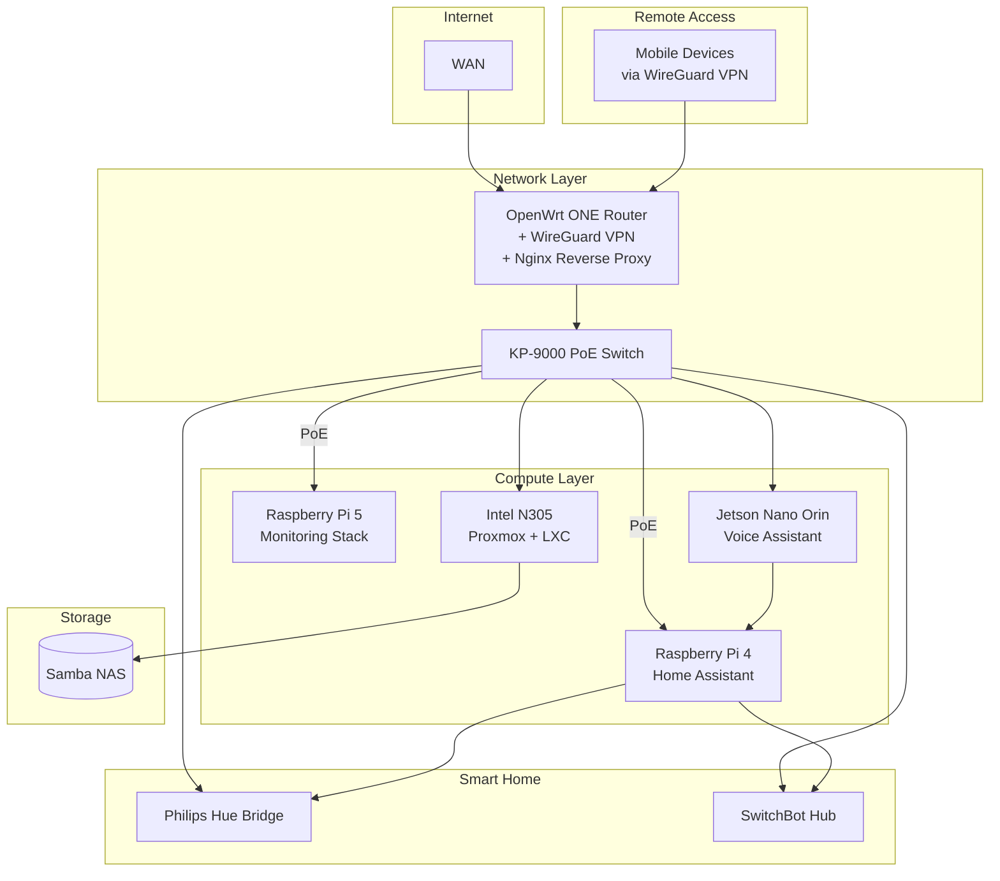

+++
title = 'Small But Mighty Homelab: DeskPi 12U Running 20+ Services'
date = 2026-01-02T14:56:44+09:00
draft = false
tags = ["Docker", "Raspberry Pi", "Linux", "Homelab"]
+++

## TL;DR

You don't need a server room to run a powerful homelab. With just a few host machines - a couple of Raspberry Pis, a mini PC, and a Jetson - you can run 20+ services: media streaming, photo backup, password management, smart home automation, monitoring, and even a local AI voice assistant. All in a compact, elegant setup that fits in a corner of a tiny apartment.

This post walks through my homelab architecture - how I got here, how it's organized, and what it can do.

**Contents:**
1. Evolution
2. Architecture Overview
3. Physical Foundation
4. Network Infrastructure
5. Compute Hosts & Devices
6. Services & Applications
7. Cost Breakdown
8. Lessons Learned

## 1. Evolution

Living in a 10 sqm studio apartment in Tokyo, space is extremely limited. Every square centimeter counts.

My homelab started simple: a metal rack with a Raspberry Pi 4 and a hard disk running Samba NAS. As my needs grew, so did the setup.

I moved to a TV rack as services expanded - Home Assistant, monitoring, Docker services. It worked, but:
- Cluttered mess of cables
- Ate up precious floor space
- Collected dust like crazy

The solution? Graduating to a DeskPi 12U rack - vertical consolidation for small spaces, cleaner look, and better dust management.

## 2. Architecture Overview

## 3. Physical Foundation

### The DeskPi 12U Rack Layout

The DeskPi 12U rack is the physical foundation. It's visually pleasant and keeps dust at bay - a huge improvement over the open TV rack.

### Power Management and Cooling

Power comes from a 650W TUF Gaming power supply - repurposed from my old main PC. Plenty of headroom for the entire rack.

For cooling, I installed 2x 12cm fans at the bottom of the rack, providing airflow from bottom to top. This keeps everything running cool without being too noisy.

## 4. Network Infrastructure

### OpenWrt ONE Router

The network starts with an OpenWrt ONE router - an open-source, hacker-friendly device that handles:
- Routing, firewall, and DHCP
- Nginx reverse proxy for local service names (e.g., `jellyfin.local` instead of `192.168.1.50:8096`)
- WireGuard VPN for secure remote access via port forwarding

### KP-9000-9XHP-X-AC Managed Switch

The PoE managed switch serves dual purpose:
- Network switching for all devices in the rack
- PoE power delivery to both Raspberry Pis - eliminating two power adapters and reducing cable clutter

## 5. Compute Hosts & Devices

### Raspberry Pi 4 (PoE-powered)
- **Role:** Smart home automation
- Powered via PoE HAT - one less cable to manage

### Raspberry Pi 5 (PoE-powered)
- **Role:** Monitoring and observability
- Powered via PoE HAT

### Intel N305 Mini PC
- **Role:** Main Docker host (Proxmox + LXC container)
- Intel i3-N305 (12th gen)
- 4x Intel i226-V 2.5G NICs
- 2x NVMe slots, 6x SATA 3.0 bays
- DDR5 RAM (32GB), PCIe x1, Type-C
- 1TB NVMe + 2x 8TB Seagate IronWolf (ZFS mirror)

**Why the N305 over other options?**

I considered Synology/QNAP NAS devices, used enterprise mini PCs, and Intel NUCs. The N305 NAS board won because:
- **6 SATA bays** - room to expand storage without external enclosures
- **4x 2.5G NICs** - network flexibility for VLANs or link aggregation
- **Intel Quick Sync** - hardware transcoding for Jellyfin without GPU
- **x86 architecture** - better Docker compatibility than ARM alternatives
- **Low power** - efficient enough to run 24/7
- **DDR5 + NVMe** - modern and fast for running 20+ containers

### Jetson Nano Orin Super
- **Role:** Local voice assistant

### Smart Home Controllers
- **Philips Hue bridge** - Zigbee lighting
- **SwitchBot hub** - SwitchBot devices integration

## 6. Services & Applications

### Smart Home (Pi 4)
- Home Assistant - controlling Hue lights, SwitchBot devices, and automations

### Monitoring Stack (Pi 5)
- Grafana - dashboards and visualization
- Prometheus - metrics collection
- Alertmanager - alert routing and notifications
- Uptime Kuma - service uptime monitoring

### Media Stack (N305)
- Jellyfin - media streaming with Intel Quick Sync hardware transcoding
- Komga - comics/manga reader
- Radarr, Sonarr, Prowlarr - media automation (behind Gluetun VPN)
- qBittorrent - downloads (behind VPN)
- Mylar + Kapowarr - comics management

### File Management (N305)
- Samba NAS - network file sharing
- Filebrowser - web UI for downloads
- JDownloader2 - direct downloads
- Syncthing - cross-device file sync

### Applications (N305)
- Vaultwarden - password manager (Bitwarden-compatible)
- Immich - photo backup with ML-powered search
- Homer - dashboard
- n8n - workflow automation
- LanguageTool - grammar checker

### Voice Assistant (Jetson)
- Local voice control via Home Assistant - no cloud required ([see my previous post](/posts/voicellm/))

### Network Services (OpenWrt ONE)
- Nginx Reverse Proxy - local service names for easy access, no more remembering IP:port combinations
- WireGuard VPN - secure remote access to the homelab when away from home

## 7. Cost Breakdown

Here's roughly what this setup costs:

| Component | Approx. Price |
|-----------|---------------|
| [DeskPi RackMate T2 12U](https://deskpi.com/products/deskpi-rackmate-t2-rackmount-12u-server-cabinet-for-network-servers-audio-and-video-equipment) | ~$100-150 |
| [Raspberry Pi 4 4GB](https://www.raspberrypi.com/products/raspberry-pi-4-model-b/) | ~$60 |
| [Raspberry Pi 5 8GB](https://www.raspberrypi.com/products/raspberry-pi-5/) | ~$95 |
| PoE+ HAT x2 | ~$50 |
| [Intel N305 NAS motherboard](https://cwwk.net/products/12th-i3-n305-n100-nas-motherboard-6-bay-dc-power-2xm-2-nvme-6xsata3-0-pcie-x1-4x-i226-v-2-5g-lan-ddr5-itx-mainboard) (bare board) | ~$200-300 |
| DDR5 RAM (16-32GB) | ~$120-400 |
| NVMe SSD (1TB) | ~$70-150 |
| NAS HDD (8TB) | ~$150-200 each |
| [Jetson Orin Nano Super](https://www.nvidia.com/en-us/autonomous-machines/embedded-systems/jetson-orin/nano-super-developer-kit/) | ~$249 |
| [OpenWrt ONE router](https://www.tomshardware.com/networking/open-source-openwrt-one-router-released-at-usd89-hacker-friendly-device-sports-two-ethernet-ports-three-usb-ports-with-dual-band-wi-fi-6) | ~$89 |
| KeepLink PoE managed switch | ~$100-150 |
| Misc (cables, fans, accessories) | ~$50-100 |
| **Total (excl. RAM/storage)** | **~$1,000-1,250** |

RAM and storage costs depend on your capacity needs. Due to AI infrastructure demand, DDR5 prices are elevated.

*Prices as of January 2026 - check current listings as memory prices are volatile.*

Not cheap, but this replaces multiple cloud subscriptions and gives you full control over your data. The N305 and Jetson are the priciest components - you could start smaller with just the Pis and add more later.

## 8. Lessons Learned

Building this setup taught me a few things:

- **Go vertical with an enclosed rack** - Saves floor space and keeps dust out. The DeskPi 12U rack was a game-changer compared to the open TV rack.
- **Use PoE where possible** - Fewer power adapters, fewer cables, cleaner setup. The managed switch powers both Pis.
- **Repurpose what you have** - The 650W TUF Gaming PSU from my old PC now powers the N305 PC.
- **Hardware transcoding matters** - The N305's Intel Quick Sync handles Jellyfin effortlessly. Choose your hardware with your workloads in mind.
- **Take your time** - Perfecting the setup took a few days. The DeskPi's flexibility with parts and accessories makes it worth the effort.

The rack assembly isn't more complex than building a PC - just more of them. If you can do one, you can do this.

---

## What's Next

This post covered the architecture - the what and why. In upcoming posts, I'll dive into the how: step-by-step guides for setting up each service, from Jellyfin and the *arr stack to Immich and Vaultwarden.

Stay tuned.
